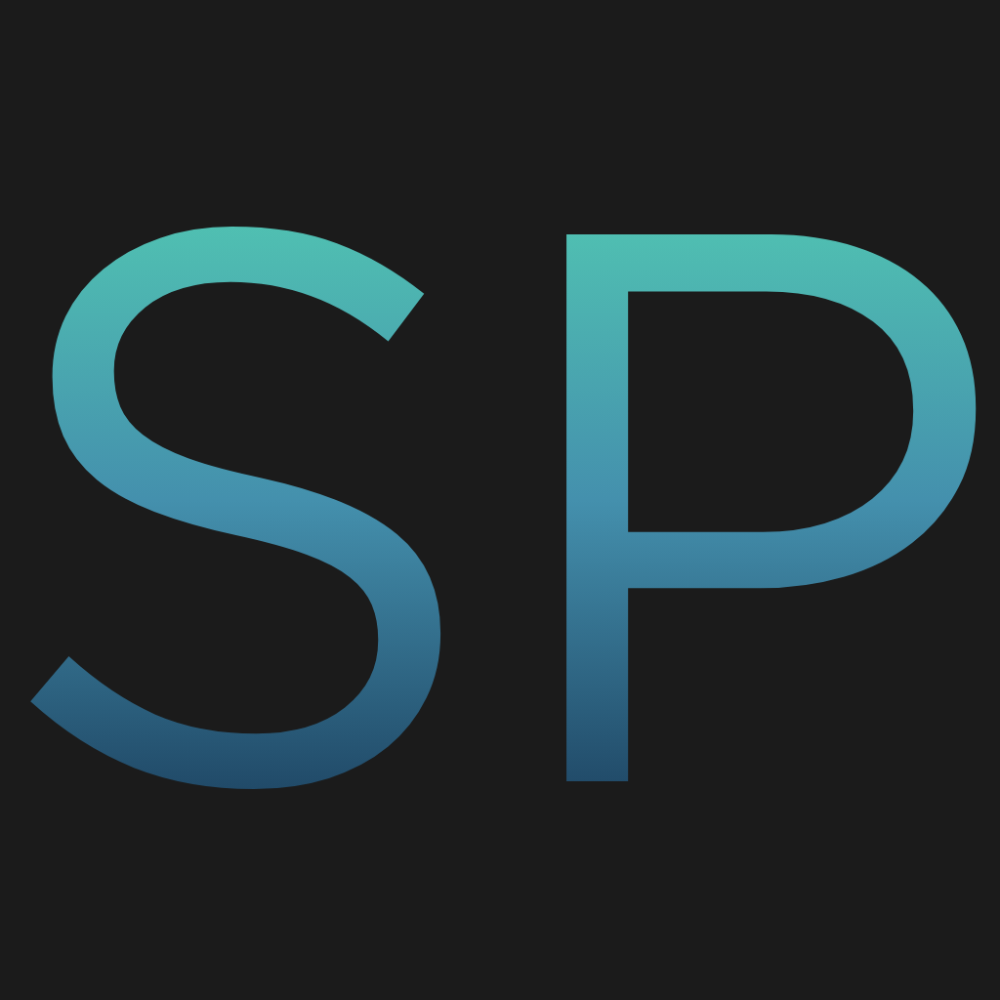

# SkyPaint Release
Beta version releases of SkyPaint.

<p align="center">
  
</p>

## Download links

[Download for Windows](https://github.com/Morningskies/Sky-Paint-Release/releases/tag/Windows)

[Download for MacOS](https://github.com/Morningskies/Sky-Paint-Release/releases/tag/MacOS)

## Features

- Painting and editing tools including brush, eraser, fill, selection, and layer-based workflows.
- Layer list, visibility toggles, opacity controls, navigator preview, undo/redo, and PNG export.
- AI-assisted features including object selection, object masking, background removal, mask refinement, harmonization, and landscape mixing.
- Optional local ONNX background-removal model support.
- Optional native C++ filter backend for Gaussian blur, Hue/Saturation, and Brightness/Contrast, with JavaScript fallback.
- Shortcuts including `Ctrl/Cmd+Click` on a layer to select opaque pixels and `Alt/Option+S`, then `1`, to expand the current selection by 1px.

## Optional Components

Build the native filter backend:

```bash
npm run build:native
```

If `native/build/Release/skypaint_native.node` exists, SkyPaint uses it automatically for supported filters.

For local AI background removal, place a compatible `.onnx` model in `assets/models` or `ai/models`.